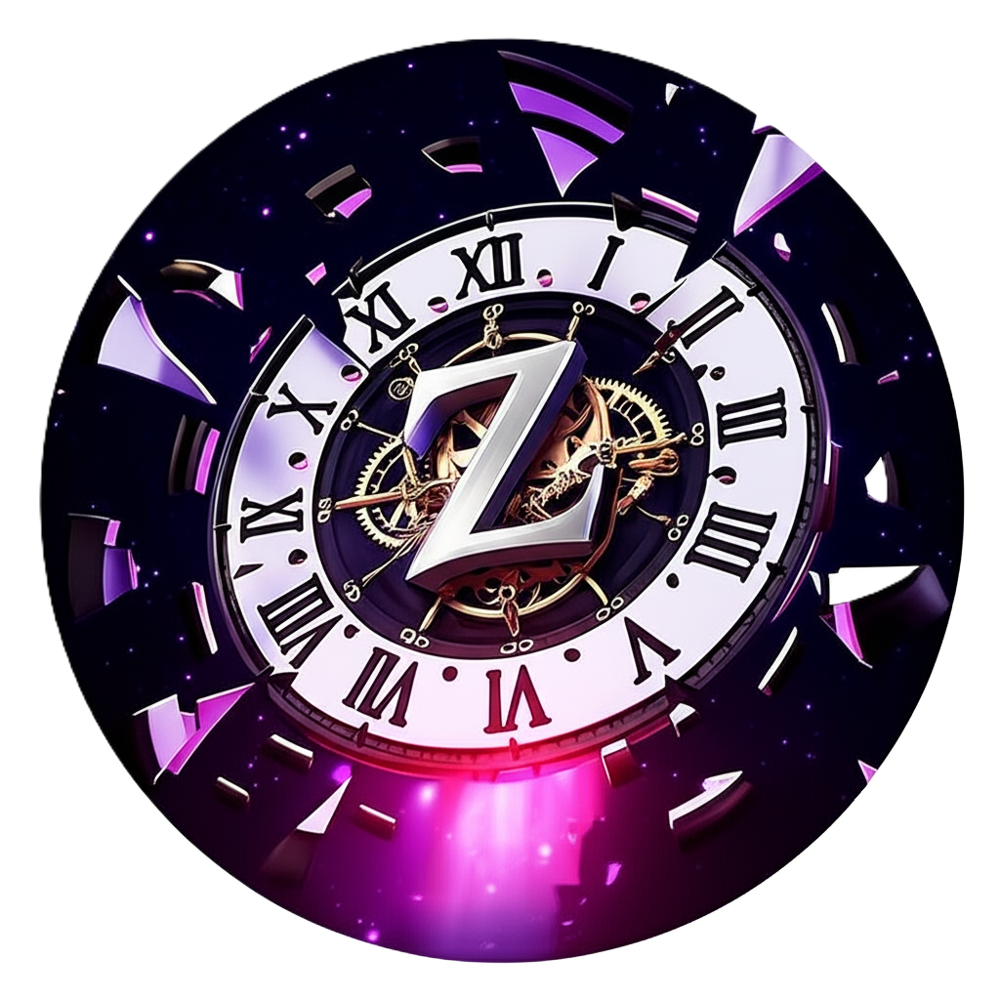

# ZENISTA 2025 🚀

**National Level Technical Symposium Website**  
Department of Electronics and Communication Engineering  
Sri Sairam Engineering College



## 🌟 Event Overview

ZENISTA 2025 is a premier National Level Technical Symposium featuring cutting-edge technology competitions, innovative challenges, and networking opportunities for students across India.

**📅 Event Date:** 8th August 2025  
**📍 Venue:** Sri Sairam Engineering College, Chennai  
**🏆 Total Prize Pool:** ₹60,500+

## 🎯 Events Lineup

### 🔧 Technical Events
- **CLOCKS AND KINGS** - Chess Tournament (₹10,000)
- **Circuit Symphony** - Electronics Design (₹8,000)
- **Code Chronos** - Programming Competition (₹7,500)
- **Signal Quest** - Signal Processing (₹6,000)
- **Robo Temporal** - Robotics Challenge (₹12,000)
- **Quantum Bridge** - Advanced Tech (₹9,000)

### 🎪 Non-Technical Events
- **Time Capsule Trivia** - Quiz Competition (₹5,000)
- **Chrono Debates** - Debate Competition (₹4,000)
- **Retro Gaming Arena** - Gaming Tournament (₹6,000)

## 🛠️ Tech Stack

### Frontend
- **React 18** with TypeScript
- **Vite** - Fast build tool
- **Tailwind CSS** - Utility-first styling
- **Framer Motion** - Smooth animations
- **Shadcn/UI** - Modern UI components

### Features
- 🎨 **Responsive Design** - Mobile-first approach
- 🌙 **Dark Theme** - Time travel cosmic design
- 🎬 **Background Video** - Immersive experience
- 🤖 **AI Chatbot** - Interactive assistance
- 📱 **WhatsApp Integration** - Direct contact
- 🎵 **Background Music** - Atmospheric audio
- ⚡ **Fast Loading** - Optimized performance

## 🚀 Getting Started

### Prerequisites
- Node.js 18+ 
- npm or yarn

### Installation

1. **Clone the repository**
   ```bash
   git clone https://github.com/Mohamed-Irreef/Zenista-Sympo-2k25.git
   cd Zenista-Sympo-2k25
   ```

2. **Install dependencies**
   ```bash
   npm install
   ```

3. **Set up environment variables**
   ```bash
   cp .env.example .env
   ```
   Update the `.env` file with your Google Forms URLs for event registration.

4. **Start development server**
   ```bash
   npm run dev
   ```

5. **Open in browser**
   ```
   http://localhost:8080
   ```

## 📝 Registration System

The website uses **Google Forms** for event registration to ensure:
- ✅ Simple and reliable registration process
- ✅ No CORS issues or backend complexity
- ✅ Automatic data collection and management
- ✅ Easy access for participants

### Setting up Registration Forms

1. Create Google Forms for each event
2. Update the `.env` file with form URLs:
   ```env
   VITE_PAPER_PRESENTATION_FORM_URL=https://forms.gle/YOUR_FORM_ID
   VITE_CODE_CHRONOS_FORM_URL=https://forms.gle/YOUR_FORM_ID
   # ... add all 9 event form URLs
   ```

## 🎨 Design Features

### Theme: Time Travel & Cosmic
- **Color Palette:** Deep space blues, cosmic purples, time portal effects
- **Typography:** Futuristic fonts with glow effects
- **Animations:** Smooth transitions, particle effects, floating elements
- **Background:** Space-time travel video with cosmic patterns

### Mobile Optimization
- Responsive chatbot interface
- Touch-friendly navigation
- Optimized button sizes
- Mobile-first component design

## 📞 Contact & Support

- **WhatsApp:** +91 99420 03192
- **Email:** zenista2025@sairam.edu.in
- **Address:** Sri Sairam Engineering College, West Tambaram, Chennai

## 🤝 Contributing

1. Fork the repository
2. Create a feature branch (`git checkout -b feature/amazing-feature`)
3. Commit changes (`git commit -m 'Add amazing feature'`)
4. Push to branch (`git push origin feature/amazing-feature`)
5. Open a Pull Request

## 📜 Scripts

```bash
# Development
npm run dev          # Start development server

# Building
npm run build        # Build for production
npm run preview      # Preview production build

# Linting
npm run lint         # Check code quality
```

## 📂 Project Structure

```
src/
├── components/          # Reusable UI components
│   ├── ui/             # Shadcn UI components
│   ├── Navigation.tsx  # Header navigation
│   ├── HeroSection.tsx # Landing section
│   ├── EventsSection.tsx # Events showcase
│   ├── ChatBot.tsx     # AI assistant
│   └── Footer.tsx      # Footer with contacts
├── pages/              # Page components
├── assets/             # Images, videos, audio
├── lib/                # Utility functions
└── hooks/              # Custom React hooks
```

## 🌟 Key Features Implemented

- [x] **Responsive Design** - Works on all devices
- [x] **Background Video** - Cosmic time travel theme
- [x] **Interactive Chatbot** - Event information assistant
- [x] **Google Forms Integration** - Simple registration system
- [x] **WhatsApp Contact** - Direct communication channel
- [x] **Smooth Animations** - Framer Motion powered
- [x] **Dark Theme** - Space-time aesthetic
- [x] **Mobile Navigation** - Touch-friendly interface
- [x] **Event Showcase** - Detailed event information
- [x] **Gallery Section** - Visual content display
- [x] **Team Section** - Organizer profiles
- [x] **FAQ Section** - Common questions answered

## 📊 Performance

- ⚡ **Lighthouse Score:** 95+ 
- 🔄 **Hot Module Replacement** - Instant updates during development
- 📦 **Code Splitting** - Optimized bundle sizes
- 🖼️ **Image Optimization** - Fast loading media

## 🔧 Deployment

### Netlify (Recommended)
1. Connect repository to Netlify
2. Set build command: `npm run build`
3. Set publish directory: `dist`
4. Deploy automatically on git push

### Vercel
1. Import project to Vercel
2. Configure build settings
3. Deploy with zero configuration

## 📄 License

This project is created for ZENISTA 2025 - Sri Sairam Engineering College.

## 🎉 Acknowledgments

- **Department of ECE** - Sri Sairam Engineering College
- **Event Organizers** - ZENISTA 2025 Team
- **Contributors** - All developers and designers

---

**Built with ❤️ for ZENISTA 2025**

*Step into the future of technology at ZENISTA 2025! 🚀*
